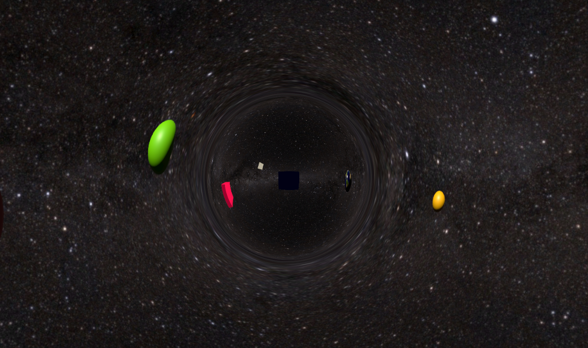

# Games and Graphics Wormhole

<!-- ABOUT THE PROJECT -->
## About The Project
Wormhole Simulation for Games and Graphics Project 2020



### Prerequisites

What things you need to install the software and how to install them

```
* Unity 2019.4.8f
```

## Built With

* [Unity](https://unity.com/) - Link to Unity Technologies page

## Authors

* **Jaiden Chicote** - *Initial work* - [jChicote](https://github.com/jChicote)

## License

No license is applied to this repository

## Acknowledgments

* Hat tip to anyone whose code was used
* Inspiration
* etc